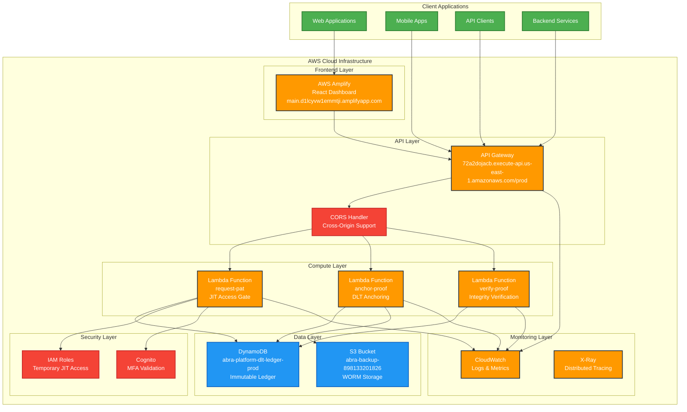
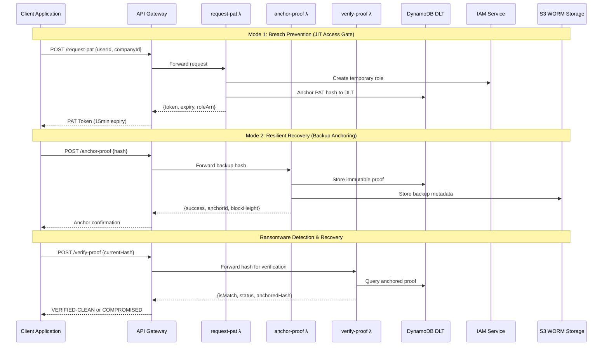
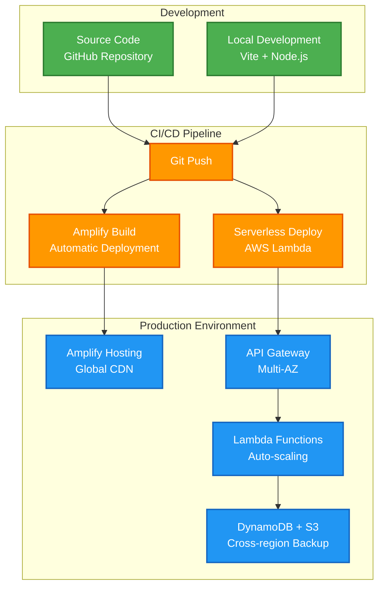

# A.B.R.A. Platform Architecture

## System Overview



## Data Flow Architecture



## Security Architecture

```mermaid
graph LR
    subgraph "Zero Trust Principles"
        ZT1[Never Trust<br/>Always Verify]
        ZT2[Least Privilege<br/>Access]
        ZT3[Assume Breach<br/>Mindset]
    end

    subgraph "Authentication Layer"
        MFA[Multi-Factor<br/>Authentication]
        PAT[Personal Access<br/>Tokens (15min)]
        JIT[Just-In-Time<br/>Access]
    end

    subgraph "Authorization Layer"
        TEMP_IAM[Temporary<br/>IAM Roles]
        POLICY[Least Privilege<br/>Policies]
        EXPIRE[Auto-Expiry<br/>Mechanism]
    end

    subgraph "Data Protection"
        HASH[SHA-256<br/>Hashing]
        DLT[Immutable<br/>DLT Ledger]
        WORM[Write-Once<br/>Read-Many]
    end

    subgraph "Network Security"
        HTTPS[HTTPS/TLS 1.3]
        CORS_SEC[CORS Policy]
        WAF[Web Application<br/>Firewall]
    end

    ZT1 --> MFA
    ZT2 --> PAT
    ZT3 --> JIT

    MFA --> TEMP_IAM
    PAT --> POLICY
    JIT --> EXPIRE

    TEMP_IAM --> HASH
    POLICY --> DLT
    EXPIRE --> WORM

    HASH --> HTTPS
    DLT --> CORS_SEC
    WORM --> WAF

    classDef security fill:#F44336,stroke:#C62828,stroke-width:2px,color:#fff
    classDef data fill:#2196F3,stroke:#1565C0,stroke-width:2px,color:#fff
    classDef network fill:#9C27B0,stroke:#6A1B9A,stroke-width:2px,color:#fff

    class ZT1,ZT2,ZT3,MFA,PAT,JIT,TEMP_IAM,POLICY,EXPIRE security
    class HASH,DLT,WORM data
    class HTTPS,CORS_SEC,WAF network
```

## Component Architecture

### Frontend (React + Vite)
- **Framework**: React 18 with modern hooks
- **Build Tool**: Vite for fast development and optimized builds
- **Styling**: Tailwind CSS with PostCSS processing
- **State Management**: useReducer for predictable state updates
- **API Layer**: Fetch API with error handling and CORS support

### Backend (AWS Serverless)
- **Runtime**: Node.js 18 with AWS SDK v3
- **Functions**: 3 Lambda functions with single responsibility
- **Database**: DynamoDB with on-demand scaling
- **Storage**: S3 with Object Lock for WORM compliance
- **API**: API Gateway with CORS and rate limiting

### Security Implementation
- **Zero Trust**: No permanent credentials stored
- **JIT Access**: 15-minute token expiry with automatic cleanup
- **Immutable Audit**: DLT anchoring prevents tampering
- **Encryption**: SHA-256 hashing with cryptographic signatures

## Deployment Architecture



## Technology Stack

### Frontend Stack
- **React 18**: Modern component-based UI framework
- **Vite**: Next-generation frontend build tool
- **Tailwind CSS**: Utility-first CSS framework
- **Lucide React**: Modern icon library
- **AWS Amplify**: Hosting and CI/CD platform

### Backend Stack
- **AWS Lambda**: Serverless compute platform
- **Node.js 18**: JavaScript runtime with AWS SDK v3
- **API Gateway**: RESTful API management
- **DynamoDB**: NoSQL database with global tables
- **S3**: Object storage with WORM compliance

### DevOps Stack
- **GitHub**: Version control and collaboration
- **AWS CloudFormation**: Infrastructure as Code
- **CloudWatch**: Monitoring and logging
- **AWS X-Ray**: Distributed tracing (optional)

## Performance Characteristics

### Scalability
- **Lambda**: Auto-scales from 0 to 1000+ concurrent executions
- **DynamoDB**: On-demand scaling with burst capacity
- **API Gateway**: Handles millions of requests per second
- **Amplify CDN**: Global edge locations for low latency

### Availability
- **SLA**: 99.9% uptime with multi-AZ deployment
- **Recovery**: Cross-region backup and failover
- **Monitoring**: Real-time health checks and alerts

### Security
- **Encryption**: Data encrypted in transit and at rest
- **Access Control**: IAM roles with least privilege
- **Audit Trail**: Immutable DLT logging
- **Compliance**: WORM storage for regulatory requirements